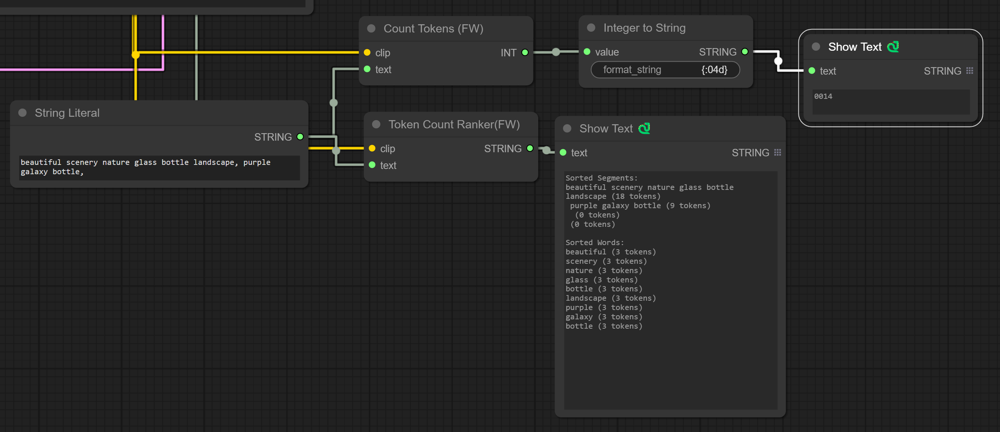

# Fearnworks Custom Nodes 

A collection of ComfyUI nodes. These nodes are tailored for specific tasks, such as counting files in directories and sorting text segments based on token counts.

Currently this is only tested on SDXL 1.0 models. An additional swich is needed to hand 1.x 

## Installation
- Clone this repository into your ComfyUI custom nodes directory.

## Nodes:

### CountTokens
This node counts the number of tokens in a given text string using the CLIP tokenizer from the transformers library. It's useful for analyzing text complexity and preprocessing text data.

- Inputs: CLIP model, Text (String)
- Outputs: Token Count (Integer)

## TokenCountRanker

Sorts segments and words within a text string by their token count, providing two lists: one for segments and one for words. This node aids in text analysis by highlighting the most complex parts of a given text.

- Inputs: CLIP model, Text (String)
- Outputs: Sorted Text by Token Count (String)

## TrimToTokens
Trims a text string to include only a specified number of tokens. This node is particularly useful in scenarios where you need to limit the length of text inputs to certain token thresholds.

- Inputs: CLIP model, Text (String), Number of Tokens (Integer)
- Outputs: Trimmed Text (String)

## FileCountInDirectory
Counts the number of files within a given directory, with an option to filter by file type. This node is essential for managing and analyzing file systems, ensuring efficient handling of directories and files.

- Inputs: Directory Path (String), File Types (String, optional)
Outputs: File Count (Integer)
